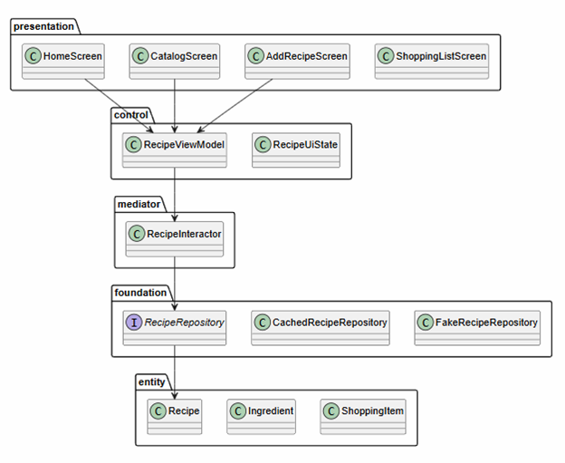
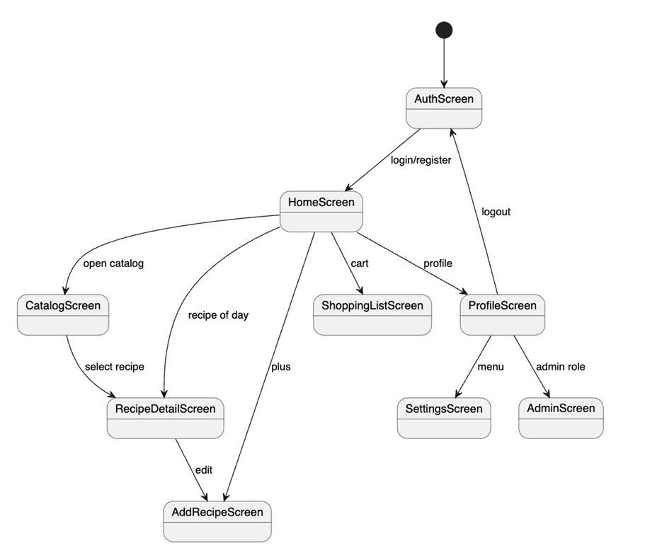

# Android-клиент «Ладушки»

Этот каталог открывается в Android Studio как отдельный проект.

## Быстрые ссылки

| Раздел | Ссылка |
|---|---|
| Корневое описание проекта | [../README.md](../README.md) |
| Документация по методичке | [../docs/README.md](../docs/README.md) |
| Архитектура PCMEF | [../docs/02-architecture/pcmef-mobile.md](../docs/02-architecture/pcmef-mobile.md) |
| UI-концепция | [../docs/08-ui/ui-concept.md](../docs/08-ui/ui-concept.md) |
| REST API | [../docs/09-api/openapi-endpoints.md](../docs/09-api/openapi-endpoints.md) |
| Диаграмма навигации | [../docs/images/21-navigation-diagram.png](../docs/images/21-navigation-diagram.png) |
| Диаграмма Android-слоёв | [../docs/images/22-android-layers-diagram.png](../docs/images/22-android-layers-diagram.png) |

## Соответствие методичке

| Требование мобильной траектории | Реализация |
|---|---|
| Android Native | Kotlin + Jetpack Compose |
| 5+ экранов | Реализовано 9 экранов |
| Навигация | `navigation-compose` + нижняя панель |
| ViewModel + StateFlow | `RecipeViewModel`, `RecipeUiState` |
| Retrofit + OkHttp | `foundation/remote/RecipeApi.kt`, `NetworkModule.kt` |
| Room для кэширования | `foundation/local/AppDatabase.kt`, `RecipeDao.kt` |
| Доступ без интернета | Локальное сохранение рецептов без технического баннера |
| REST API | 18 методов в `RecipeApi` |
| JWT | `TokenStore` хранит токен, `NetworkModule` добавляет `Authorization: Bearer <token>` |
| Авторизация | `AuthScreen` + `RecipeViewModel.login/register` |
| Настройки | `SettingsScreen` + `UserSettings` |
| Админ-панель | `AdminScreen`, доступна для роли `ADMIN` |
| Фото рецепта | системный выбор изображения через `OpenDocument` |
| КБЖУ | `Nutrition` в доменной модели рецепта |
| Ингредиенты | отдельные поля для названия, количества и единицы измерения |
| Профиль | имя и аватар сохраняются в `SharedPreferences` по email аккаунта |

## Структура PCMEF

```text
app/src/main/java/ru/course/recipemanager/
├── presentation/        # Presentation: Compose UI, экраны, компоненты
├── control/             # Control: ViewModel, состояние, обработка действий UI
├── mediator/            # Mediator: бизнес-сценарии приложения
├── entity/              # Entity: Recipe, Ingredient, ShoppingItem, UserProfile
└── foundation/          # Foundation: Repository, Retrofit, Room, DTO, mappers
```

Схема слоёв Android-клиента:



## Как открыть

1. Android Studio → Open.
2. Выбрать папку `app`.
3. Дождаться Gradle Sync.
4. Запустить модуль `app`.

Проект зафиксирован на стабильном Gradle Wrapper:

```text
gradle/wrapper/gradle-wrapper.properties
distributionUrl=https://services.gradle.org/distributions/gradle-8.7-bin.zip
```

Это исправляет ситуацию, когда Android Studio пытается скачать `gradle-9.0-milestone-1-bin.zip`.

## Основные экраны

- `HomeScreen` — главная и рецепт дня.
- `CatalogScreen` — поиск и фильтры рецептов.
- `RecipeDetailScreen` — ингредиенты, шаги, добавление в покупки.
- `AddRecipeScreen` — форма создания и редактирования рецепта, фото, КБЖУ и ингредиентов с граммовкой.
- `ShoppingListScreen` — чек-лист покупок с блоками «Осталось купить» и «Уже куплено», количеством и единицами.
- `ProfileScreen` — профиль, аватар, имя и меню действий.
- `AuthScreen` — вход и регистрация.
- `SettingsScreen` — пользовательские переключатели сохранения, доступа без интернета и уведомлений.
- `AdminScreen` — статистика, жалобы пользователей, рецепты на проверке и удаление рецептов.

Навигация между экранами описана в диаграмме:



## Локальное хранение профиля

`foundation/local/ProfileStore.kt` сохраняет имя и `avatarUri` пользователя в `SharedPreferences`.
Ключ строится по email, поэтому при смене аккаунта у каждого пользователя остается свой аватар.

## Тестовые входы

- Пользователь: `user@ladushki.app`, пароль `1234`
- Администратор: `admin@ladushki.app`, пароль `1234`

## Подключение к серверу

Сейчас приложение использует `FakeRecipeRepository`, чтобы дизайн запускался без сервера. Для клиент-серверного режима нужно заменить создание репозитория в `RecipeViewModel` на `CachedRecipeRepository(api, dao, tokenStore)`.

Серверный базовый URL для эмулятора Android обычно выглядит так:

```kotlin
NetworkModule.createRecipeApi(
    baseUrl = "http://10.0.2.2:8080/api/",
    tokenProvider = { tokenStorage.getAccessToken() }
)
```
