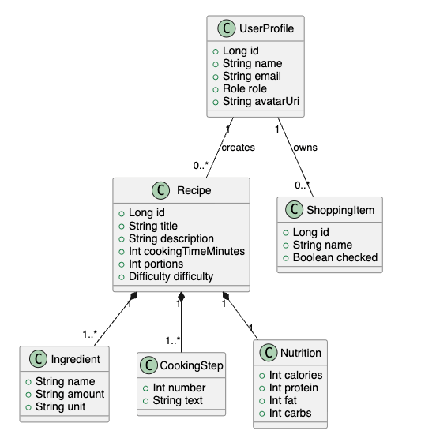

# Domain Model

## Основные сущности

| Сущность | Связи |
|---|---|
| UserProfile | владеет личными настройками и аватаром |
| Recipe | содержит Ingredients, CookingSteps, Nutrition |
| ShoppingItem | создаётся из ингредиентов рецепта |
| AdminStats | агрегирует пользователей, рецепты и жалобы |

## Описание модели

Доменная модель строится вокруг рецепта. Рецепт содержит название, описание, категорию, время приготовления, количество порций, сложность, изображение, список ингредиентов, шаги приготовления и КБЖУ. Это позволяет использовать одну сущность и для краткой карточки в каталоге, и для детального экрана.

Пользовательская часть модели включает профиль, роль, избранные рецепты, настройки и список покупок. Администратор не является отдельной сущностью: это пользователь с ролью `ADMIN`, которому доступны дополнительные сценарии модерации.

## Ограничения модели

- Ингредиенты относятся к конкретному рецепту и не ведутся как отдельный глобальный справочник.
- Позиции списка покупок могут быть созданы из рецепта, но живут отдельно, чтобы пользователь мог отмечать их независимо.
- КБЖУ хранится в составе рецепта, потому что используется на экране карточки и при выборе блюда.
- Статус модерации нужен только для рецептов, созданных пользователями.

## Связь с кодом

В Android-клиенте доменная модель представлена Kotlin-классами в пакете `entity`. На сервере модель реализована JPA-сущностями в пакете `entity`. Для передачи между клиентом и сервером используются DTO и мапперы, чтобы не смешивать формат API с UI-моделью.
