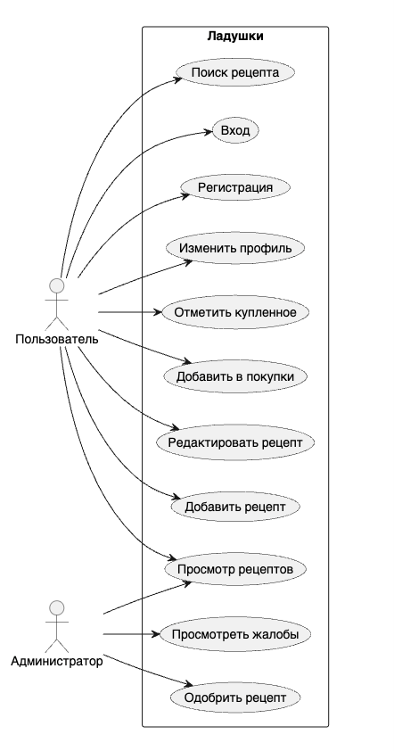

# Требования

| ID | Требование | Приоритет |
|---|---|---|
| FR-01 | Пользователь может войти или зарегистрироваться | High |
| FR-02 | Пользователь может просматривать рецепты | High |
| FR-03 | Пользователь может добавлять рецепт с фото | High |
| FR-04 | Пользователь может вести список покупок | High |
| FR-05 | Администратор может одобрять рецепты | Medium |
| FR-06 | Профиль сохраняет имя и аватар | Medium |

## Функциональные требования

### FR-01. Авторизация

Пользователь должен иметь возможность зарегистрироваться и войти в систему по email и паролю. После успешного входа backend возвращает JWT, который используется для защищённых запросов. Пароль не хранится в открытом виде: сервер сохраняет BCrypt-хеш.

### FR-02. Каталог рецептов

Пользователь должен видеть список рецептов с краткой информацией: название, категория, изображение, время приготовления и сложность. Каталог должен поддерживать поиск по названию и фильтрацию по категории.

### FR-03. Создание рецепта

Пользователь должен иметь возможность создать рецепт, указав название, описание, категорию, ингредиенты с количеством и единицей измерения, шаги приготовления, КБЖУ и изображение. Новый рецепт отправляется на модерацию.

### FR-04. Список покупок

Пользователь должен иметь возможность добавлять ингредиенты рецепта в список покупок, отмечать купленные позиции и очищать список полностью или только купленные товары.

### FR-05. Администрирование

Администратор должен видеть статистику, список рецептов на проверке и жалобы пользователей. Для рецепта доступны действия одобрения и отклонения.

## Нефункциональные требования

| ID | Требование | Критерий |
|---|---|---|
| NFR-01 | Мобильная реализация | Android Native, Kotlin, Jetpack Compose |
| NFR-02 | Backend | Java 17, Spring Boot, PostgreSQL |
| NFR-03 | API | 8+ REST endpoints и Swagger UI |
| NFR-04 | Безопасность | JWT, BCrypt, роли USER/ADMIN |
| NFR-05 | Offline | Room cache и SharedPreferences |
| NFR-06 | Тестирование | Backend-покрытие выше 40% |

## Приоритеты MVP

В MVP включены авторизация, каталог, карточка рецепта, добавление рецепта, список покупок, профиль, настройки и админ-панель. Эти функции покрывают минимально необходимую ценность приложения и требования мобильной траектории методички.
