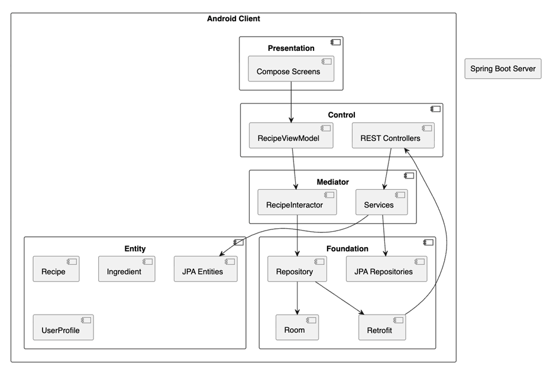
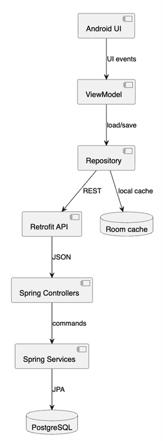

# 02. Архитектура

Раздел описывает адаптацию PCMEF к мобильному клиент-серверному проекту.

| Артефакт | Файл |
|---|---|
| PCMEF диаграмма | [pcmef-diagram.md](pcmef-diagram.md) |
| Mobile PCMEF | [pcmef-mobile.md](pcmef-mobile.md) |
| ADR | [adr.md](adr.md) |
| Интерфейсы | [interfaces.md](interfaces.md) |
| Диаграмма зависимостей | [dependency-diagram.md](dependency-diagram.md) |

## Архитектурный подход

Проект реализует мобильную траекторию, поэтому архитектура распределена между Android-клиентом и Spring Boot backend. На клиенте находятся UI, состояние экранов, локальное хранение и сетевой слой. На сервере находятся REST-контроллеры, бизнес-логика, сущности, репозитории, безопасность и интеграция с PostgreSQL.

PCMEF используется как общий принцип разделения ответственности. Даже когда Android использует MVVM-подход, его элементы сопоставляются с PCMEF: Compose-экраны относятся к Presentation, ViewModel к Control, Interactor к Mediator, модели к Entity, а Repository/Room/Retrofit к Foundation.

## Ключевые качества архитектуры

- зависимость слоёв направлена сверху вниз;
- бизнес-логика не хранится в Compose-экранах;
- DTO отделены от доменных моделей через мапперы;
- backend контроллеры делегируют работу сервисам;
- локальный кэш отделён от REST API через Repository.
