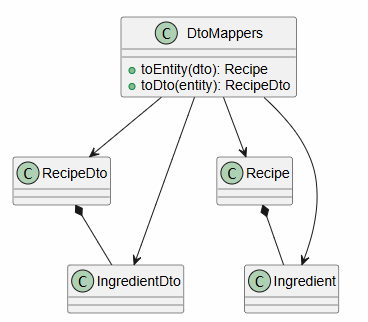

# Спецификация интерфейсов

| Интерфейс | Назначение |
|---|---|
| `RecipeRepository` | Контракт доступа к рецептам, профилю и покупкам |
| `RecipeApi` | Retrofit REST API |
| `RecipeDao` | Room DAO для локального кэша |
| `ProfileStore` | SharedPreferences для имени и аватара |

## Контракт `RecipeRepository`

`RecipeRepository` является главным интерфейсом Foundation-слоя Android-клиента. Через него ViewModel и Interactor получают рецепты, профиль, настройки, покупки и административную статистику. Благодаря этому UI не зависит от того, откуда пришли данные: из fake-репозитория, REST API или Room.

Ключевые методы:

- `login(email, password)` — авторизация пользователя;
- `getRecipes()` — получение каталога;
- `addRecipe(recipe)` — создание рецепта;
- `toggleFavorite(recipeId)` — изменение избранного;
- `addIngredientsToShoppingList(ingredients)` — перенос ингредиентов;
- `getAdminStats()` — получение данных админ-панели.

## Контракт `RecipeApi`

`RecipeApi` описывает REST API backend в терминах Retrofit. Методы интерфейса соответствуют эндпоинтам `/api/auth`, `/api/recipes`, `/api/shopping-list`, `/api/settings` и `/api/admin`.

## Контракт `RecipeDao`

`RecipeDao` отвечает за локальное хранение рецептов и списка покупок. Он используется как fallback, если сервер недоступен. Это делает offline-сценарий частью архитектуры, а не отдельной временной заглушкой.

## Вывод

Интерфейсы фиксируют границы слоёв. Благодаря им можно тестировать сервисы и репозитории отдельно, а также менять источник данных без изменения пользовательского интерфейса.
