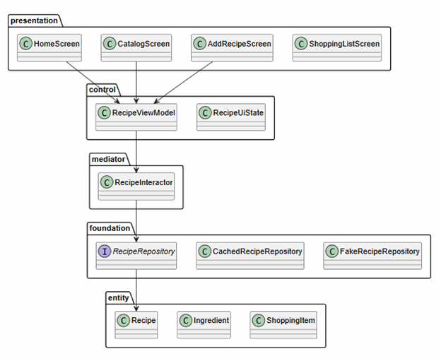

# PCMEF для мобильной траектории




## Распределение слоев

| Слой | Расположение | Ответственность |
|---|---|---|
| Presentation | Мобильный клиент | Экраны, визуальные компоненты, ввод данных |
| Control | Spring Boot | REST-контроллеры, DTO, валидация запросов |
| Mediator | Spring Boot | Сервисы рецептов, избранного, покупок, транзакции |
| Entity | Spring Boot | JPA-сущности предметной области |
| Foundation | Spring Boot | Репозитории, PostgreSQL, интеграции |

## Клиентская адаптация

В мобильном клиенте дополнительно выделяются:

- `presentation`: Compose-экраны и компоненты.
- `control`: `RecipeViewModel` и `RecipeUiState`, обработка действий пользователя.
- `mediator`: `RecipeInteractor`, бизнес-сценарии приложения.
- `entity`: `Recipe`, `Ingredient`, `ShoppingItem`, `UserProfile`.
- `foundation`: `RecipeRepository`, Retrofit API, Room DAO, DTO и мапперы.

## Направление зависимостей

```text
Presentation -> ViewModel -> ApiClient / LocalCache -> REST API
REST API -> Control -> Mediator -> Entity -> Foundation -> PostgreSQL
```

Вышележащие компоненты знают только о нижележащих контрактах. Серверные контроллеры не содержат бизнес-логики, а репозитории не зависят от сервисов или UI.

## Структура Android Studio проекта

```text
app/app/src/main/java/ru/course/recipemanager/
├── presentation
│   ├── LadushkiApp.kt
│   ├── components
│   └── screens
├── control
│   ├── RecipeUiState.kt
│   └── RecipeViewModel.kt
├── mediator
│   └── RecipeInteractor.kt
├── entity
│   ├── Recipe.kt
│   ├── Ingredient.kt
│   ├── ShoppingItem.kt
│   └── UserProfile.kt
└── foundation
    ├── RecipeRepository.kt
    ├── FakeRecipeRepository.kt
    ├── CachedRecipeRepository.kt
    ├── local
    │   ├── Room cache
    │   └── ProfileStore SharedPreferences
    └── remote
```