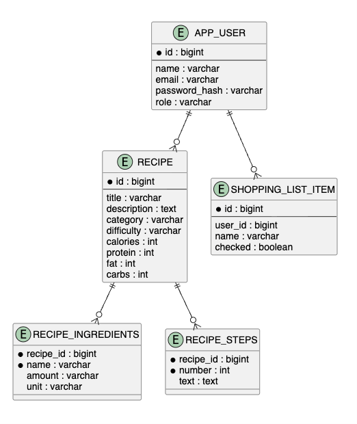

# 03. Проектирование базы данных

| Артефакт | Файл |
|---|---|
| ER-диаграмма | [er-diagram.md](er-diagram.md) |
| DDL | [ddl.sql](ddl.sql) |
| ORM-стратегия | [orm.md](orm.md) |

## Назначение раздела

Раздел описывает хранение данных backend-части и локального Android-кэша. Для серверной части используется PostgreSQL и JPA/Hibernate. Для мобильного клиента используется Room, который хранит кэш рецептов и списка покупок.

## Основные решения

- пользователи хранятся отдельно от рецептов;
- рецепт содержит вложенные коллекции ингредиентов и шагов;
- статус рецепта используется для модерации;
- список покупок хранится отдельно от рецепта;
- локальный кэш Android не заменяет серверную БД, а помогает при временной недоступности сети.

## Связь с реализацией

Серверные таблицы формируются JPA-сущностями из пакета `ru.course.recipemanager.entity`. Репозитории находятся в пакете `foundation`. Android Room-сущности находятся в `foundation/local`.
