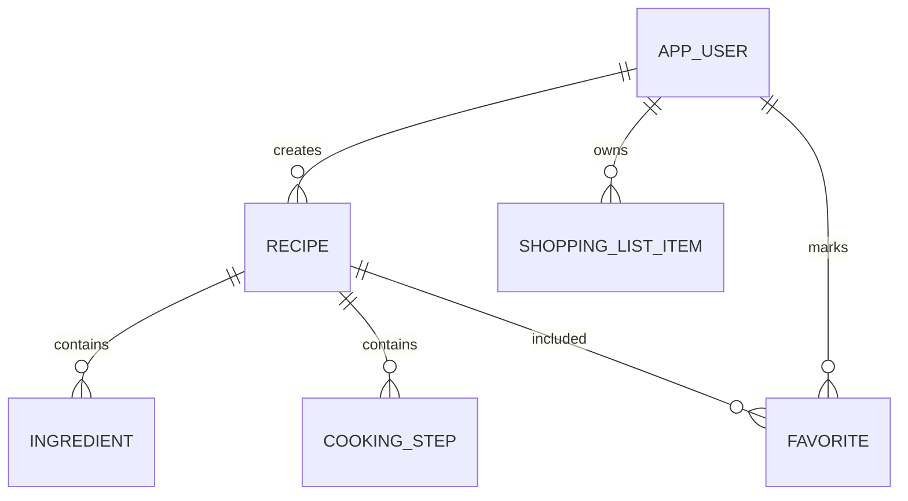

# ER-диаграмма

Поле `RECIPE.status` хранит статус модерации рецепта: `PENDING`, `APPROVED` или `REJECTED`.

## Описание связей

Пользователь может создавать несколько рецептов, поэтому связь между `APP_USER` и `RECIPE` имеет тип один-ко-многим. Рецепт содержит несколько ингредиентов и шагов приготовления. Эти элементы логически зависят от рецепта и не имеют самостоятельного смысла без него.

Список покупок связан с пользователем, а не напрямую с рецептом. Это важно: после добавления ингредиентов пользователь может удалить часть продуктов, отметить их купленными или очистить список. Такие действия не должны менять исходный рецепт.

## Нормализация

Модель разделяет пользователей, рецепты, ингредиенты, шаги и покупки. Это снижает дублирование и позволяет развивать систему: например, добавить избранное, жалобы, комментарии или историю модерации без перестройки всей базы.

## Ограничения целостности

- email пользователя должен быть уникальным;
- рецепт должен иметь название и категорию;
- ингредиент должен быть связан с рецептом;
- статус рецепта ограничен допустимыми значениями;
- позиция покупок должна иметь признак `checked`.
