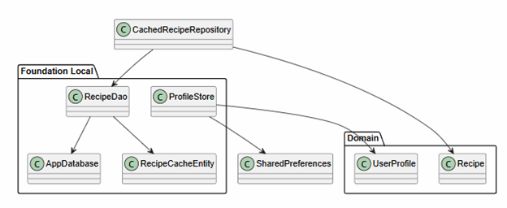

# ORM стратегия

| Сущность | Таблица | Репозиторий |
|---|---|---|
| `Recipe` | `recipe` | `RecipeRepository` |
| `Ingredient` | `ingredient` | через рецепт |
| `ShoppingListItem` | `shopping_list_item` | `ShoppingListRepository` |
| `AppUser` | `app_user` | `UserRepository` |

## Стратегия JPA

Сервер использует Spring Data JPA. Это позволяет описывать сущности через Java-классы и аннотации, а типовые операции выполнять через репозитории. Для учебного проекта такой подход удобен: он демонстрирует ORM, но не перегружает код ручными SQL-запросами.

## Коллекции рецепта

Ингредиенты и шаги приготовления хранятся как вложенные коллекции рецепта. В JPA для этого используется `@ElementCollection`. Такой вариант подходит, потому что ингредиент в текущей версии не является самостоятельным справочником и используется только внутри конкретного рецепта.

## Репозитории

`RecipeRepository` содержит методы поиска по названию, категории и статусу. `UserRepository` используется для регистрации и входа, а `ShoppingListRepository` — для списка покупок. Репозитории относятся к Foundation-слою и не должны содержать бизнес-правила.

## Вывод

ORM-стратегия отделяет предметные сущности от физического доступа к базе. Это соответствует PCMEF: Entity описывает данные, Foundation обеспечивает сохранение, Mediator управляет бизнес-операциями.
