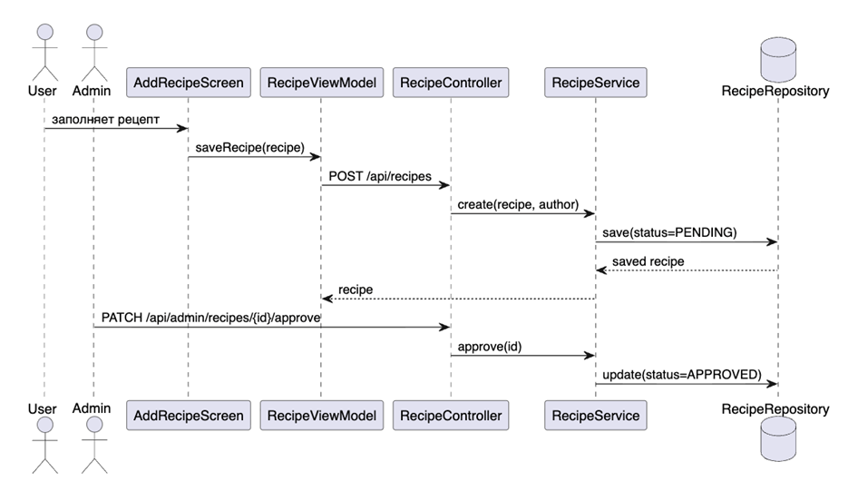

# 04. Детальное проектирование

| Артефакт | Файл |
|---|---|
| Диаграммы последовательности | [sequence-diagrams.md](sequence-diagrams.md) |
| Спецификации методов | [methods-specifications.md](methods-specifications.md) |
| Диаграмма классов | [design-classes-diagram.md](design-classes-diagram.md) |
| PlantUML | [plantuml-diagrams.puml](plantuml-diagrams.puml) |

## Назначение раздела

Детальное проектирование связывает требования с конкретными классами и методами. На этом этапе становится понятно, какие объекты участвуют в сценариях, какие методы вызываются и где проходит граница между Android-клиентом и backend.

## Основные проектные решения

- UI не обращается напрямую к базе или REST API.
- `RecipeViewModel` хранит состояние экранов и запускает сценарии.
- `RecipeInteractor` отделяет бизнес-операции от ViewModel.
- `RecipeRepository` позволяет переключаться между fake-данными и сетевым репозиторием.
- Backend-сервисы отвечают за модерацию, авторизацию и список покупок.
