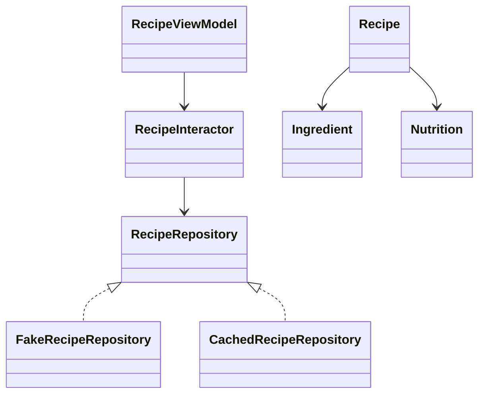

# Диаграмма классов проектирования

## Описание классов Android-клиента

`RecipeViewModel` является центральным классом Control-слоя. Он принимает действия пользователя с экранов, запускает корутины, вызывает `RecipeInteractor` и обновляет `RecipeUiState`. Состояние хранится через `StateFlow`, поэтому Compose-экраны автоматически перерисовываются при изменении данных.

`RecipeInteractor` выполняет роль Mediator. Он скрывает детали репозитория и предоставляет сценарии уровня приложения: загрузить рецепты, добавить рецепт, обновить профиль, сохранить настройки, сформировать покупки.

`RecipeRepository` — контракт Foundation-слоя. Его реализации:

- `FakeRecipeRepository` используется для демонстрации UI без сервера;
- `CachedRecipeRepository` работает с REST API и локальным Room-кэшем.

## Описание классов backend

На сервере `AuthController`, `RecipeController`, `ShoppingListController`, `AdminController` и другие контроллеры принимают HTTP-запросы. Сервисы `AuthService`, `RecipeService`, `ShoppingListService` выполняют бизнес-операции. JPA-сущности `Recipe`, `AppUser`, `ShoppingListItem` описывают данные, а репозитории Spring Data отвечают за сохранение.

## Вывод

Диаграмма классов показывает, что проект построен не вокруг одного большого класса, а вокруг набора слоёв и контрактов. Это снижает связность и упрощает тестирование.
