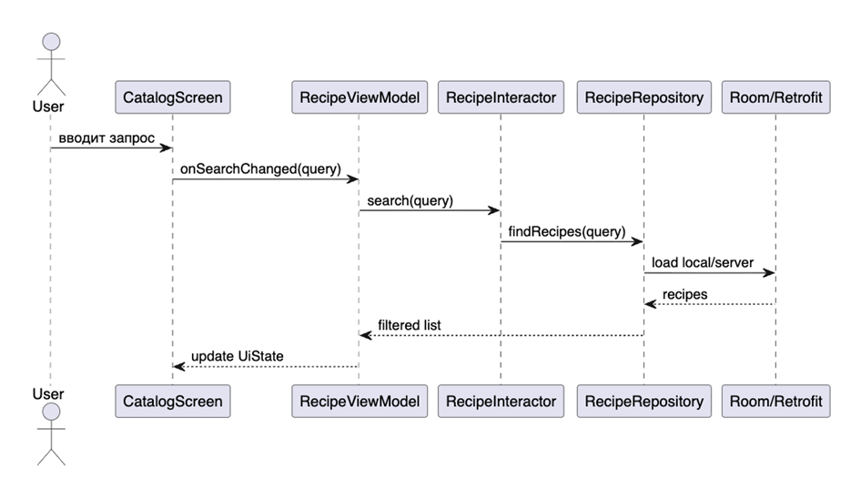
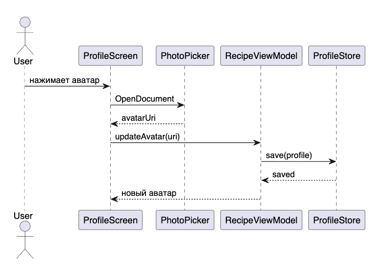
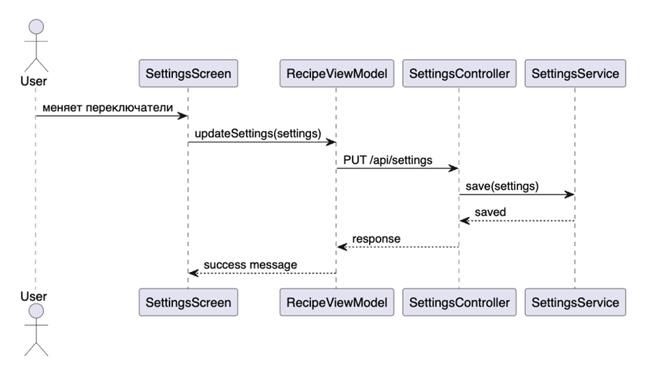
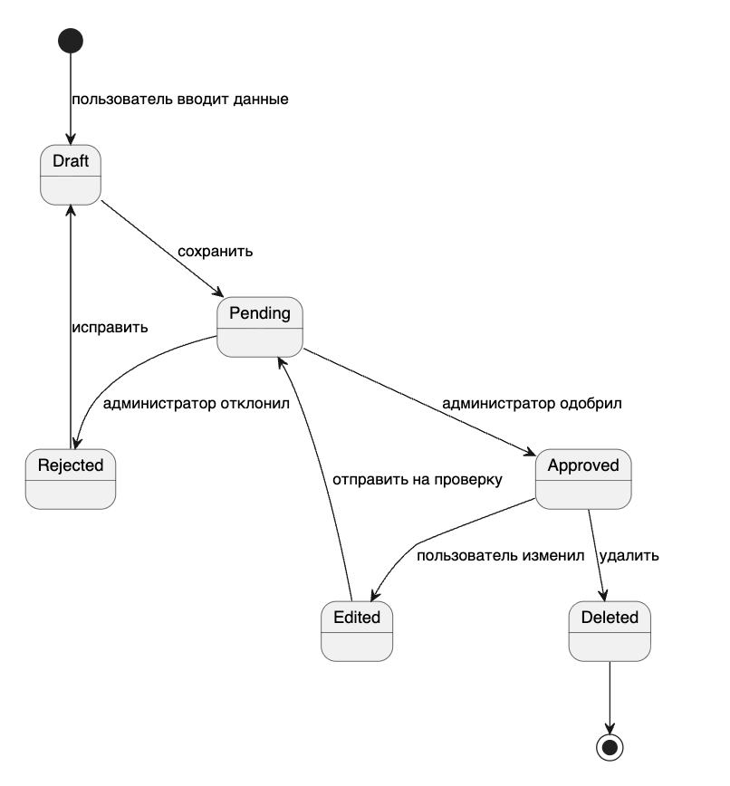
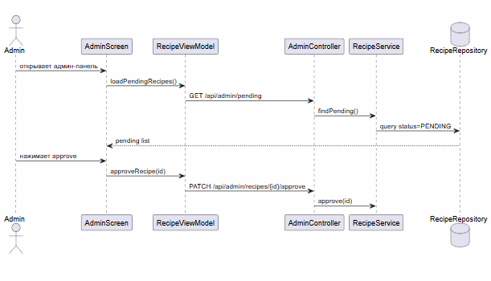
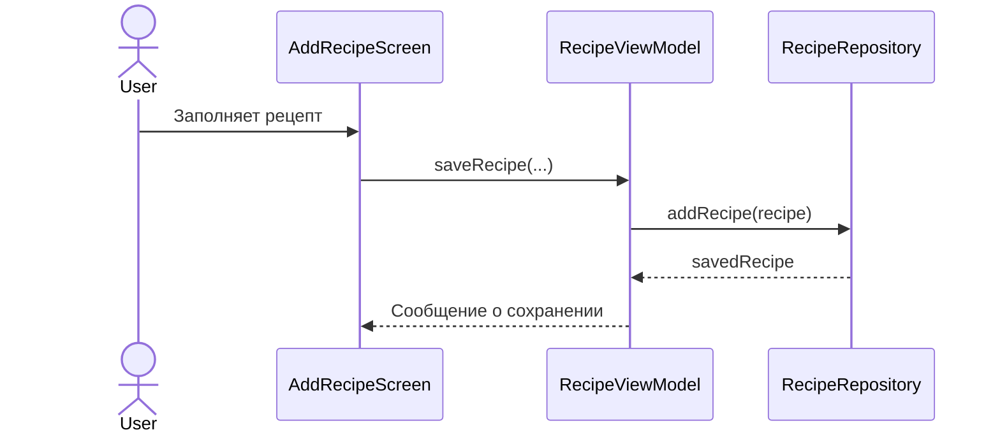
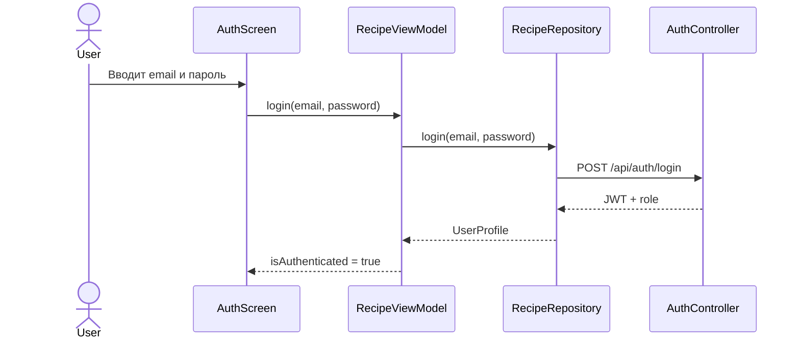
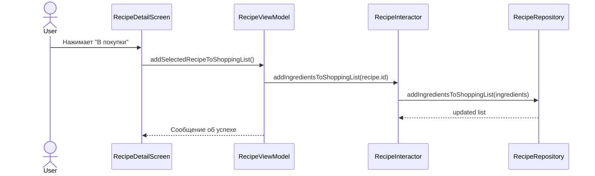
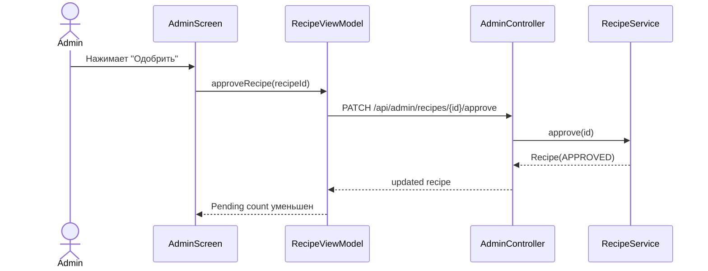

# Диаграммы последовательности

## Сценарий входа

## Сценарий добавления рецепта в покупки

## Сценарий модерации

## Вывод

Диаграммы последовательности показывают, что пользовательские действия проходят через несколько уровней: экран, ViewModel, Interactor/Repository, REST API и сервисы backend. Это подтверждает соблюдение PCMEF и отсутствие бизнес-логики в UI.
