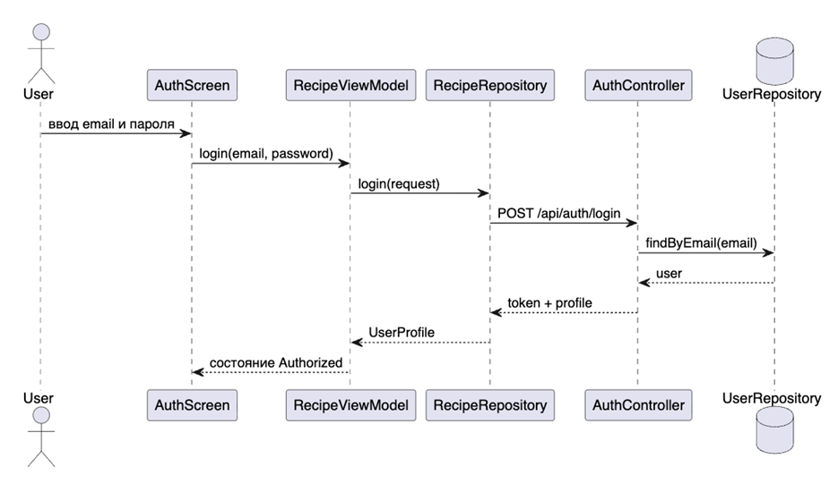
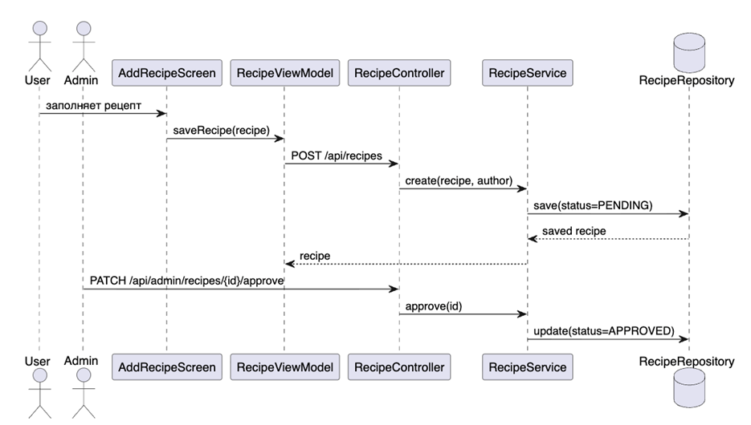
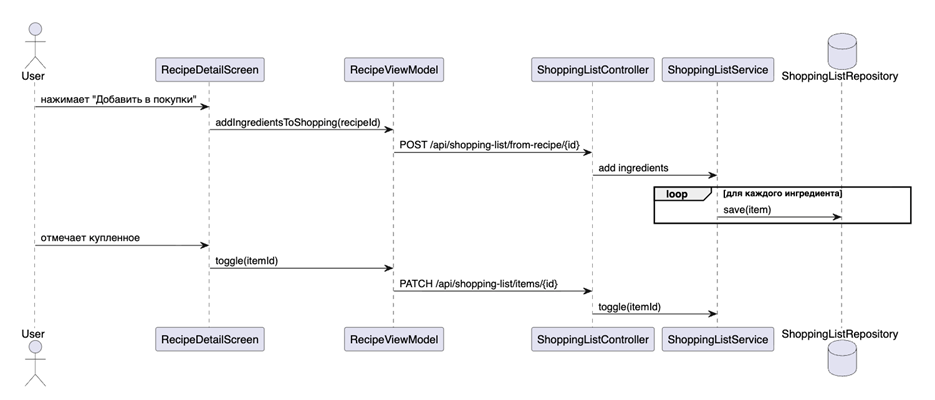
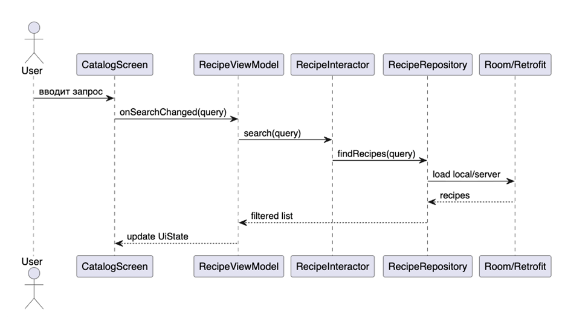
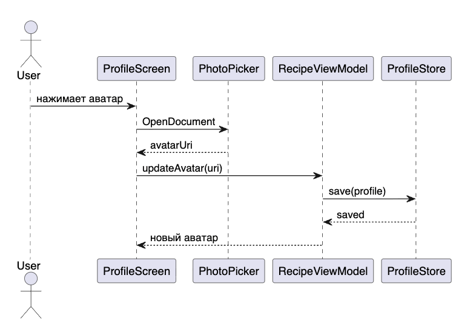
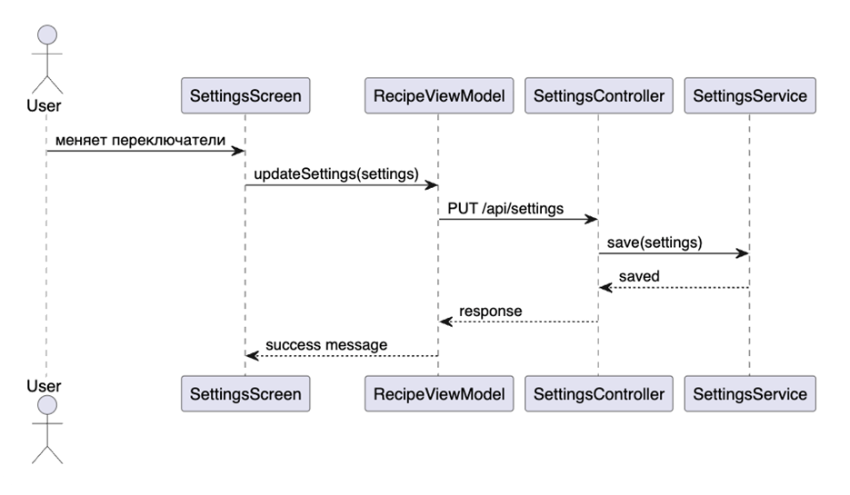
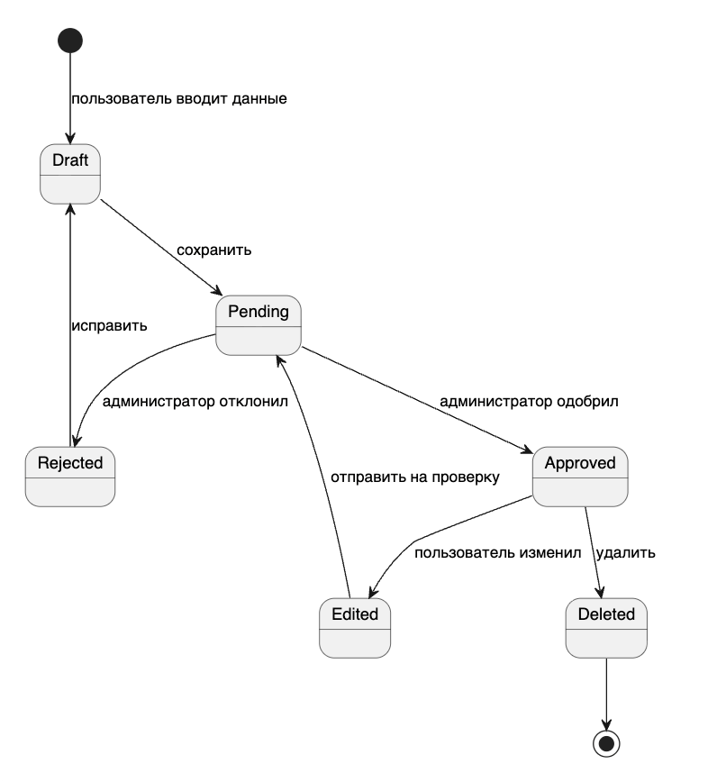
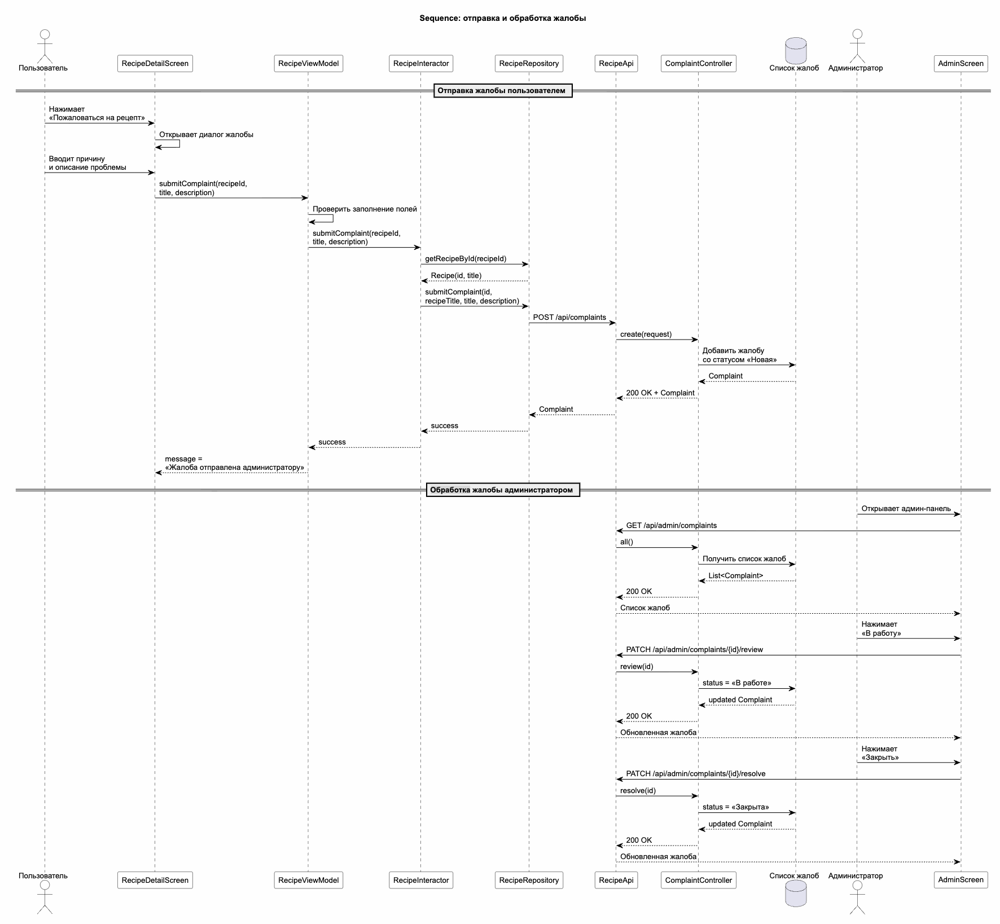

# Диаграммы последовательности

Раздел содержит готовые PNG-диаграммы последовательности из папки `docs/images`. Код диаграмм в Markdown не используется: каждая схема подключена как изображение и сопровождается пояснением.

## 1. Вход пользователя

Диаграмма показывает сценарий авторизации. Пользователь вводит email и пароль на `AuthScreen`, экран передает данные в `RecipeViewModel`, затем запрос проходит через репозиторий к backend-методу `POST /api/auth/login`. После успешного ответа клиент получает JWT и профиль пользователя, а приложение переводит состояние в авторизованное.

## 2. Добавление и модерация рецепта

Диаграмма описывает путь рецепта от заполнения формы до проверки администратором. Пользователь создает рецепт на `AddRecipeScreen`, ViewModel передает данные в бизнес-слой, Repository отправляет их на backend, после чего рецепт получает статус ожидания модерации.

## 3. Добавление ингредиентов в список покупок

Диаграмма показывает сценарий добавления ингредиентов выбранного рецепта в список покупок. Действие начинается на `RecipeDetailScreen`, проходит через `RecipeViewModel`, `RecipeInteractor` и `RecipeRepository`, а затем обновленный список отображается в мобильном приложении.

## 4. Поиск рецептов

Диаграмма фиксирует порядок поиска рецептов. Пользователь вводит запрос в каталоге, UI обновляет состояние поиска, ViewModel обращается к слою данных, а backend возвращает список рецептов, соответствующих фильтру.

## 5. Смена аватара

Диаграмма показывает работу с профилем пользователя: выбор изображения, сохранение URI аватара и обновление состояния профиля. Этот сценарий связывает `ProfileScreen`, `RecipeViewModel` и локальное хранилище профиля.

## 6. Сохранение настроек

Диаграмма описывает сохранение пользовательских настроек. Переключатели на `SettingsScreen` передаются во ViewModel, затем сохраняются через Repository и используются приложением для режима offline cache, уведомлений и параметров отображения.

## 7. Жизненный цикл рецепта

Диаграмма состояний дополняет sequence-диаграммы. Она показывает, как рецепт переходит между состояниями: создание, ожидание модерации, публикация, отклонение или удаление. Это помогает явно зафиксировать правила изменения статуса рецепта.

## 8. Жалобы и административная модерация

Диаграмма показывает действия администратора: просмотр рецептов на проверке, одобрение или отклонение, обработку жалоб. Пользовательская часть сценария начинается в карточке рецепта: `RecipeDetailScreen` открывает диалог жалобы, `RecipeViewModel` вызывает `submitComplaint`, а Repository отправляет `POST /api/complaints`. После этого администратор видит жалобу в административном контуре и переводит ее в работу или закрывает.

## Вывод

Диаграммы последовательности подтверждают, что основные сценарии приложения проходят через несколько уровней PCMEF. UI отвечает за ввод и отображение, ViewModel управляет состоянием, Interactor и Repository выполняют бизнес-сценарии, а backend обрабатывает REST-запросы и сохраняет данные.
