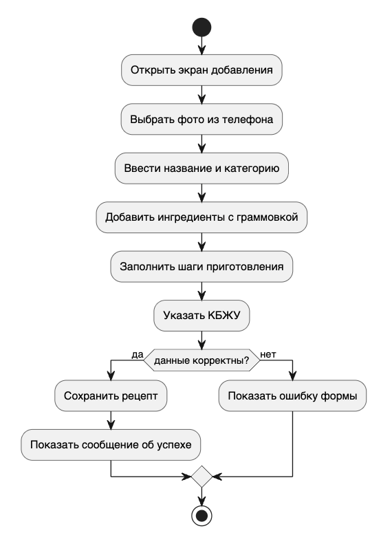
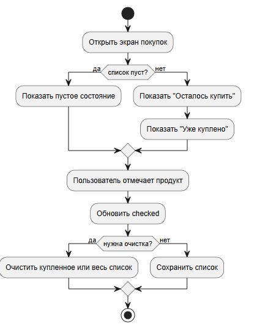

# UI-концепция мобильного приложения «Ладушки»

## Цель дизайна

Сделать интерфейс «ламповым», милым и при этом удобным для ежедневного использования: пользователь должен быстро найти рецепт, открыть ингредиенты, добавить продукты в список покупок и сохранить любимые блюда.

## Визуальный стиль

| Элемент | Решение |
|---|---|
| Основной фон | Молочный, очень светлый розовый |
| Акцент | Ягодный красный для важных действий |
| Вторичный акцент | Шалфейный зеленый для спокойных статусов |
| Карточки | Скругление, мягкая тень, крупные зоны нажатия |
| Типографика | Крупные заголовки, короткие подписи, высокая читаемость |
| Настроение | Домашнее, аккуратное, без перегруза декоративными элементами |

## Экраны

1. **Авторизация**: вход, регистрация, подсказка для админ-входа.
2. **Главная**: приветствие, рецепт дня, быстрые категории.
3. **Каталог**: строка поиска, фильтры по типу блюда, карточки рецептов.
4. **Карточка рецепта**: фото, время, сложность, КБЖУ, ингредиенты, шаги приготовления, избранное.
5. **Добавление рецепта**: название, категория, время, ингредиенты отдельными строками с количеством и единицей, заметка, КБЖУ, выбор фото из телефона.
6. **Список покупок**: отдельные блоки «Осталось купить» и «Уже куплено», количество продуктов, кликабельные строки, прогресс.
7. **Профиль**: статистика, аватар, имя, меню настроек, поддержка и выход.
8. **Настройки**: сохранение изменений, доступ без интернета, уведомления, компактный режим.
9. **Админ-панель**: статистика, модерация и удаление рецептов.

## UX-решения

- Нижняя навигация оставляет основные разделы доступными одним касанием.
- Карточки рецептов имеют крупные изображения и короткие подписи, чтобы каталог легко сканировался.
- В детальной карточке сначала показаны самые практичные данные: время, порции, сложность, затем ингредиенты и шаги.
- Список покупок разделяет оставшиеся и уже купленные продукты, чтобы пользователь не терялся в магазине.
- Технические термины скрыты из обычного пользовательского интерфейса: они остаются в документации и архитектуре.
- Нижняя навигация использует иконки вместо текстовых команд.

## Соответствие требованиям

| Требование мобильной траектории | Как отражено в дизайне |
|---|---|
| 5+ экранов | Реализовано 9 экранов в Android Jetpack Compose |
| Навигация | `navigation-compose`, нижняя панель + переход в карточку рецепта |
| Обработка состояний | Пустые/выбранные состояния в списке покупок, сообщения после действий |
| CRUD | Экран добавления и карточки для будущего редактирования |
| Работа с медиа | Выбор и замена изображения рецепта из телефона |
| Предметная область | Для рецепта отображаются калории, белки, жиры и углеводы |
| Локальное хранение | Room DAO/Database для рецептов и покупок, SharedPreferences для имени и аватара |
| REST API | Retrofit API для рецептов, избранного и покупок |

## Реализация в Android Studio

Основной и единственный клиент для сдачи находится в `app`. Дизайн перенесен в Kotlin + Jetpack Compose без HTML-макета, потому что мобильная траектория методички требует Android Native / Flutter / React Native, а не веб-страницу.
