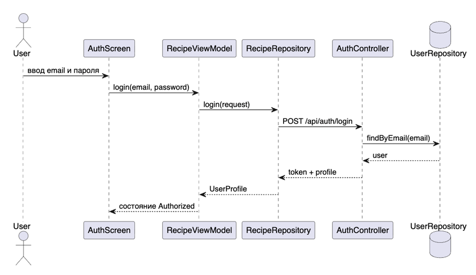
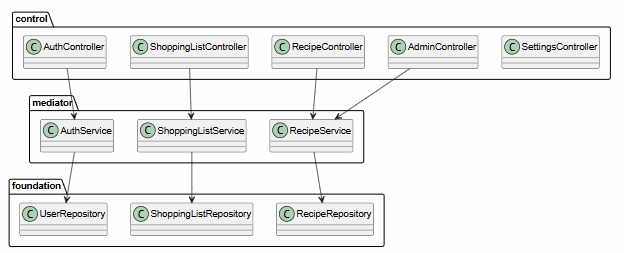

# Проверка API





| Сценарий | Endpoint | Ожидаемый результат |
|---|---|---|
| Регистрация | `POST /api/auth/register` | Возвращается JWT и роль пользователя |
| Вход | `POST /api/auth/login` | Возвращается JWT Bearer token |
| Список рецептов | `GET /api/recipes` | Возвращается каталог рецептов |
| Поиск | `GET /api/recipes/search` | Возвращается отфильтрованный список |
| Добавление рецепта | `POST /api/recipes` | Рецепт получает статус `PENDING` |
| Модерация | `PATCH /api/admin/recipes/{id}/approve` | Рецепт получает статус `APPROVED` |

## Пример проверки через curl

```bash
curl -X POST http://localhost:8080/api/auth/login \
  -H "Content-Type: application/json" \
  -d '{"email":"admin@ladushki.app","password":"1234"}'
```

В ответе должен прийти `accessToken`. Для защищённых запросов он передаётся так:

```bash
curl http://localhost:8080/api/admin/stats \
  -H "Authorization: Bearer <accessToken>"
```

## Негативные проверки

| Проверка | Ожидаемый результат |
|---|---|
| Неверный пароль | HTTP 401 |
| Запрос без JWT к `/api/recipes` | HTTP 401/403 |
| Пользовательский JWT для `/api/admin/stats` | Доступ запрещён |
| Повторная регистрация email | HTTP 409 |

## Вывод

API-проверки подтверждают, что backend поддерживает не только успешные сценарии, но и базовые ошибки авторизации и доступа.
