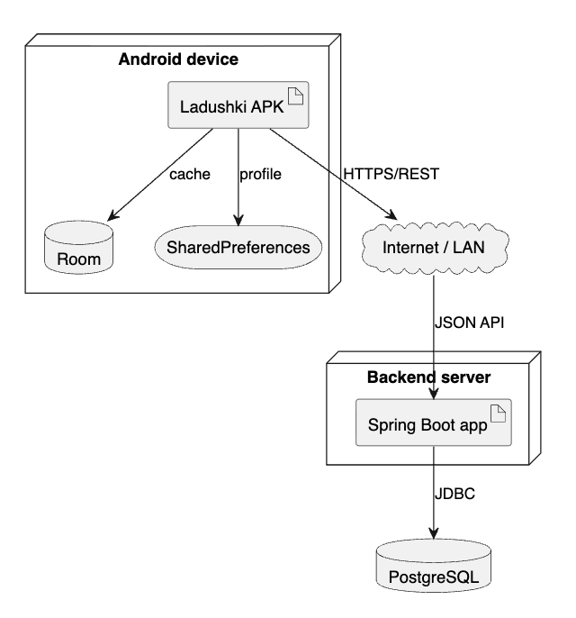

# Развертывание



1. Запустить PostgreSQL и backend через Docker Compose: `docker compose up --build`.
2. Проверить Swagger UI: `http://localhost:8082/swagger-ui.html`.
3. Открыть `app` в Android Studio.
4. Для эмулятора использовать `http://10.0.2.2:8082/api/`.
5. После входа или регистрации клиент получает JWT и отправляет его в заголовке `Authorization: Bearer <token>`.

## Подробная инструкция

### 1. Docker Compose

Основной способ локального развёртывания — Docker Compose из корня проекта:

```bash
docker compose up --build
```

Команда поднимает два контейнера:

| Сервис | Назначение | Порт |
|---|---|---|
| `postgres` | PostgreSQL с базой `ladushki` | `5433` на хосте, `5432` внутри Docker |
| `backend` | Spring Boot REST API | `8082` на хосте, `8080` внутри Docker |

Backend внутри Docker подключается к PostgreSQL по адресу `jdbc:postgresql://postgres:5432/ladushki`. На компьютере API доступен как `http://localhost:8082/api`.

Если нужен внешний порт `8080`, его можно переопределить:

```bash
BACKEND_PORT=8080 docker compose up --build
```

Остановить контейнеры можно командой:

```bash
docker compose down
```

Если нужно удалить данные PostgreSQL и начать с пустой базы:

```bash
docker compose down -v
```

### 2. PostgreSQL без Docker

Перед запуском backend нужно создать базу данных:

```sql
CREATE DATABASE ladushki;
```

Параметры подключения находятся в `server/src/main/resources/application.yml`. По умолчанию используются `username: postgres` и `password: postgres`.

### 3. Backend без Docker

Backend запускается командой:

```bash
cd server
mvn spring-boot:run
```

После запуска нужно открыть Swagger UI: `http://localhost:8080/swagger-ui.html`. Если страница открывается, сервер и OpenAPI настроены корректно.

### 4. Android

В Android Studio открывается папка `app`. Если используется эмулятор и Docker-запуск, адрес backend должен быть `http://10.0.2.2:8082/api/`. Для физического телефона нужно использовать IP компьютера в локальной сети и порт `8082`.

## Возможные проблемы

| Проблема | Решение |
|---|---|
| Docker backend не видит БД | Проверить, что сервис `postgres` healthy: `docker compose ps` |
| Backend не подключается к БД | Проверить имя базы, логин и пароль в `application.yml` |
| Android не видит сервер | Использовать `10.0.2.2` для эмулятора или IP компьютера для телефона |
| Swagger не открывается | Проверить, что Docker backend запущен на порту 8082 или Maven backend на 8080 |
| Запросы возвращают 401 | Сначала выполнить вход и передать JWT |

## Вывод

Развёртывание состоит из трёх частей: база PostgreSQL, Spring Boot backend и Android-клиент. Docker Compose упрощает первые две части, потому что база и сервер запускаются вместе. Самая частая ошибка — использовать `localhost` внутри эмулятора вместо `10.0.2.2`.
