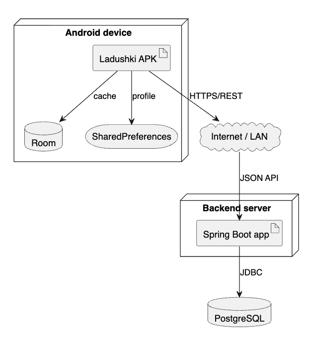

# Техническое задание

## Назначение

Разработать мобильное приложение «Ладушки» для ведения кулинарных рецептов, поиска блюд, формирования списка покупок и модерации пользовательских рецептов.

## Функциональные требования

- регистрация и вход пользователей;
- роли `USER` и `ADMIN`;
- каталог рецептов;
- поиск и фильтрация;
- добавление рецепта;
- список покупок;
- профиль и настройки;
- админ-панель модерации.

## Нефункциональные требования

- Android Native, Kotlin, Jetpack Compose;
- backend на Java 17 + Spring Boot;
- REST API и Swagger;
- JWT + Spring Security;
- PostgreSQL и Room cache;
- покрытие backend-тестами выше 40%.

## Состав системы

Система состоит из Android-клиента и backend-сервера. Android-клиент предоставляет пользовательский интерфейс, хранит часть данных локально и обращается к REST API. Backend отвечает за авторизацию, работу с рецептами, список покупок, настройки, администрирование и хранение данных в PostgreSQL.

## Основные экраны

| Экран | Назначение |
|---|---|
| Авторизация | Вход и регистрация |
| Главная | Быстрый доступ к рецептам и разделам |
| Каталог | Поиск и просмотр рецептов |
| Карточка рецепта | Детали, ингредиенты, шаги, КБЖУ |
| Добавление рецепта | Создание пользовательского рецепта |
| Список покупок | Чек-лист ингредиентов |
| Профиль | Имя, аватар, статистика |
| Настройки | Пользовательские параметры |
| Админ-панель | Модерация и жалобы |

## Требования к данным

Рецепт должен хранить название, описание, категорию, время приготовления, порции, сложность, изображение, ингредиенты, шаги и КБЖУ. Пользователь должен хранить email, имя, пароль в виде хеша и роль. Список покупок должен хранить название позиции и признак покупки.

## Приёмочные критерии

Проект принимается, если backend запускается, Swagger доступен, основные endpoint описаны, Android-клиент содержит 5+ экранов, авторизация работает через JWT, а backend-тесты дают покрытие выше 40%.
