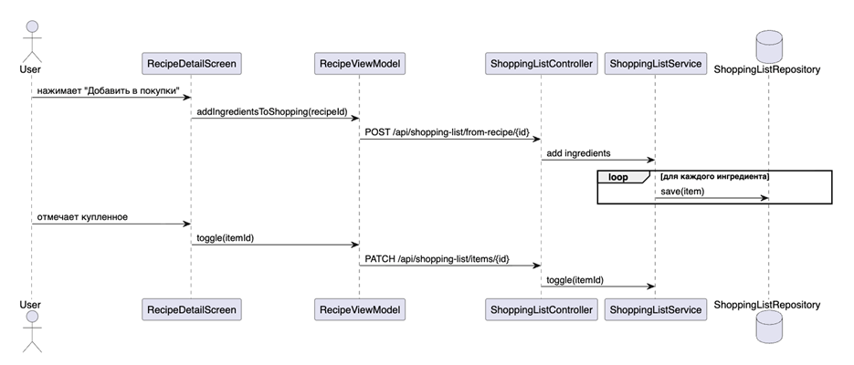

# Руководство пользователя

1. Войдите или зарегистрируйтесь.
2. Откройте каталог рецептов.
3. Создайте собственный рецепт через кнопку добавления.
4. Укажите ингредиенты, количество, КБЖУ и фото.
5. Добавьте ингредиенты в список покупок.
6. Отмечайте купленные продукты галочкой.
7. В профиле измените имя и аватар.

## Подробная инструкция

### Вход и регистрация

При первом запуске пользователь открывает экран авторизации. Можно войти в существующий аккаунт или создать новый. После входа приложение показывает главную страницу и загружает доступные рецепты.

### Поиск рецепта

На экране каталога пользователь вводит часть названия блюда или выбирает категорию. После выбора рецепта открывается карточка с описанием, ингредиентами, шагами приготовления и КБЖУ.

### Добавление рецепта

На экране добавления нужно заполнить название, категорию, время, порции, ингредиенты, заметку и пищевую ценность. Можно выбрать фото из телефона. После сохранения рецепт отправляется на проверку администратору.

### Список покупок

Из карточки рецепта можно добавить ингредиенты в список покупок. В списке продукты делятся на оставшиеся и купленные. Купленные позиции можно очистить отдельно, а весь список можно сбросить полностью.

### Профиль и настройки

В профиле пользователь меняет имя и аватар. Настройки позволяют управлять синхронизацией, offline-кэшем, уведомлениями и компактным режимом.

## Советы

Если приложение не получает данные с сервера, нужно проверить, запущен ли backend и правильно ли указан base URL. Для Android-эмулятора используется `10.0.2.2`, а не `localhost`.
