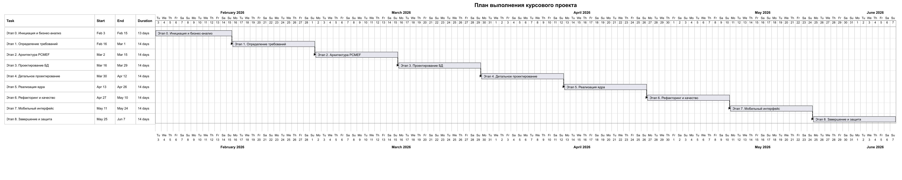

# Диаграмма Ганта

Диаграмма Ганта отражает календарный план выполнения курсового проекта по этапам жизненного цикла: от инициации и анализа требований до завершения документации и подготовки к защите.

| Этап | Период | Длительность |
|---|---|---:|
| Этап 0. Инициация и бизнес-анализ | 03.02.2026-15.02.2026 | 13 дней |
| Этап 1. Определение требований | 16.02.2026-01.03.2026 | 14 дней |
| Этап 2. Архитектура PCMEF | 02.03.2026-15.03.2026 | 14 дней |
| Этап 3. Проектирование БД | 16.03.2026-29.03.2026 | 14 дней |
| Этап 4. Детальное проектирование | 30.03.2026-12.04.2026 | 14 дней |
| Этап 5. Реализация ядра | 13.04.2026-26.04.2026 | 14 дней |
| Этап 6. Рефакторинг и качество | 27.04.2026-10.05.2026 | 14 дней |
| Этап 7. Мобильный интерфейс | 11.05.2026-24.05.2026 | 14 дней |
| Этап 8. Завершение и защита | 25.05.2026-07.06.2026 | 14 дней |

## Детализация этапов

| Этап | Работы | Результат |
|---|---|---|
| Анализ требований | тема, акторы, сценарии | требования и use case |
| Архитектура | PCMEF, ADR, зависимости | архитектурные документы |
| База данных | ER, ORM, DDL | описание хранения данных |
| Android | экраны, ViewModel, Repository | мобильное приложение |
| Backend | REST API, сервисы, JWT | серверная часть |
| Тестирование | JUnit, Mockito, JaCoCo | 19 тестов, покрытие выше 40% |
| Финализация | README, docs, архив | комплект для сдачи |

## Риски расписания

Главный риск - зависимость Android-клиента от backend. Чтобы снизить риск, основной клиент подключен через `CachedRecipeRepository`, а `FakeRecipeRepository` оставлен как запасная демо-реализация для проверки UI без запущенного сервера. Второй риск - настройка Android SDK, поэтому сборку клиента лучше проверять в Android Studio заранее.
