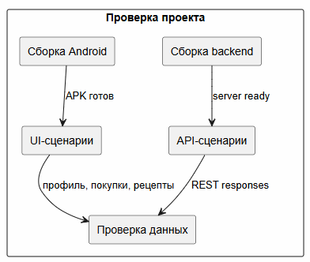

# Итоговый отчет

В эту папку можно положить PDF пояснительной записки, титульный лист, скриншоты интерфейса и итоговые материалы для сдачи.

## Состав папки

| Файл | Назначение |
|---|---|
| `explanatory-note-ladushki.docx` | Пояснительная записка |
| PDF-версия отчёта | Итоговый вариант для загрузки в LMS или отправки преподавателю |
| Скриншоты интерфейса | Иллюстрация работы Android-клиента |
| Материалы защиты | Презентация или краткий демонстрационный сценарий |

## Рекомендуемая структура пояснительной записки

1. Введение и цель проекта.
2. Анализ предметной области.
3. Требования и сценарии использования.
4. Архитектура PCMEF.
5. Проектирование базы данных.
6. Реализация Android-клиента.
7. Реализация Spring Boot backend.
8. REST API и безопасность.
9. Тестирование и покрытие.
10. Развёртывание.
11. Заключение и перспективы развития.

## Что проверить перед сдачей

- в корневом README указаны запуск, стек и API;
- в `docs/` есть все разделы по методичке;
- backend-тесты проходят;
- Swagger открывается;
- Android-проект открывается в Android Studio;
- титульный лист содержит ФИО, группу и дату сдачи.
